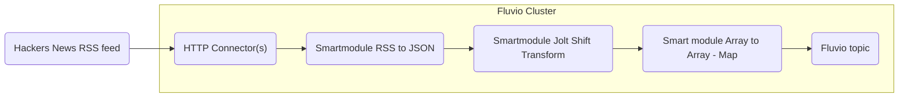

# streaming-hacker-news
Streaming hacker news rss feed using InfinyOn Cloud and Fluvio

```mermaid
graph LR;

feed("Hackers News RSS feed")
http("HTTP Connector(s)")
rss_json("Smartmodule RSS to JSON")
jolt("Smartmodule Jolt Shift Transform")
array-map("Smart module Array to Array - Map")
topic("Fluvio topic")

subgraph fc[Fluvio Cluster]

http -->rss_json-->jolt-->array-map--> topic
end
feed --> http

```
